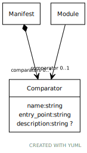

# Class: Comparator

Output comparator

URI: [test:Comparator](https://linkml.org/testing/Comparator)

## Referenced by Class

 *  **None** *[➞comparators](manifest__comparators.md)*  0..\*  **[Comparator](Comparator.md)**
 *  **None** *[➞comparator](module__comparator.md)*  0..1  **[Comparator](Comparator.md)**

## Attributes

### Own

 * [➞name](comparator__name.md)  1..1
     * Range: [String](types/String.md)
 * [➞entry_point](comparator__entry_point.md)  1..1
     * Description: Comparator entry point
     * Range: [String](types/String.md)
     * Example: utils.compare_rdf.compare_rdf None
 * [➞description](comparator__description.md)  0..1
     * Description: comparator description
     * Range: [String](types/String.md)
