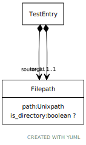

# Class: Filepath

a relative path to a file or directory

URI: [test:Filepath](https://linkml.org/testing/Filepath)

## Referenced by Class

 *  **None** *[➞source](testEntry__source.md)*  0..1  **[Filepath](Filepath.md)**
 *  **None** *[➞target](testEntry__target.md)*  1..1  **[Filepath](Filepath.md)**

## Attributes

### Own

 * [➞path](filepath__path.md)  1..1
     * Range: [Unixpath](types/Unixpath.md)
 * [➞is_directory](filepath__is_directory.md)  0..1
     * Description: True means path is directory, false means file
     * Range: [Boolean](types/Boolean.md)
