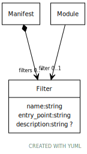

# Class: Filter

Pre comparison filters

URI: [test:Filter](https://linkml.org/testing/Filter)

## Referenced by Class

 *  **None** *[➞filters](manifest__filters.md)*  0..\*  **[Filter](Filter.md)**

## Attributes

### Own

 * [➞name](filter__name.md)  1..1
     * Range: [String](types/String.md)
 * [➞entry_point](filter__entry_point.md)  1..1
     * Description: Filter entry point
     * Range: [String](types/String.md)
     * Example: ldcontext_metadata_filter None
 * [➞description](filter__description.md)  0..1
     * Description: comparator description
     * Range: [String](types/String.md)
