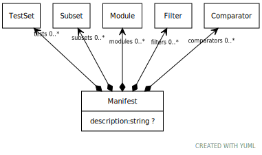

# Class: Manifest

A collection of Subsets, modules, comparators, and/or a manifest

URI: [test:Manifest](https://linkml.org/testing/Manifest)

## Attributes

### Own

 * [➞description](manifest__description.md)  0..1
     * Description: A description of the intent and purpose of a test set
     * Range: [String](types/String.md)
 * [➞subsets](manifest__subsets.md)  0..\*
     * Description: Subsets used in the model
     * Range: [Subset](Subset.md)
 * [➞comparators](manifest__comparators.md)  0..\*
     * Description: Comparators that can be referenced in the model
     * Range: [Comparator](Comparator.md)
 * [➞filters](manifest__filters.md)  0..\*
     * Description: Precomparison filters
     * Range: [Filter](Filter.md)
 * [➞modules](manifest__modules.md)  0..\*
     * Description: Testing modules
     * Range: [Module](Module.md)
 * [➞tests](manifest__tests.md)  0..\*
     * Description: Actual test sets
     * Range: [TestSet](TestSet.md)
