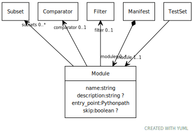

# Class: Module

LinkML software module to be tested

URI: [test:Module](https://linkml.org/testing/Module)

## Referenced by Class

 *  **None** *[➞modules](manifest__modules.md)*  0..\*  **[Module](Module.md)**
 *  **None** *[➞module](testSet__module.md)*  1..1  **[Module](Module.md)**

## Attributes

### Own

 * [➞name](module__name.md)  1..1
     * Description: Unique module name
     * Range: [String](types/String.md)
 * [➞description](module__description.md)  0..1
     * Description: Description of the module
     * Range: [String](types/String.md)
 * [➞entry_point](module__entry_point.md)  1..1
     * Description: Module name and entry point
     * Range: [Pythonpath](types/Pythonpath.md)
     * Example: YAMLLoader.load_any None
 * [➞filter](module__filter.md)  0..1
     * Description: pre comparison filter to remove metadata, etc.
     * Range: [Filter](Filter.md)
 * [➞comparator](module__comparator.md)  0..1
     * Description: Comparator to be used for the particular module's output
     * Range: [Comparator](Comparator.md)
 * [➞subsets](module__subsets.md)  0..\*
     * Description: Subset(s) that this module belongs to
     * Range: [Subset](Subset.md)
 * [➞skip](module__skip.md)  0..1
     * Description: Skip this module if true
     * Range: [Boolean](types/Boolean.md)
