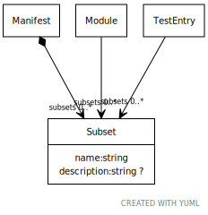

# Class: Subset

Categorization of type of test

URI: [test:Subset](https://linkml.org/testing/Subset)

## Referenced by Class

 *  **None** *[➞subsets](manifest__subsets.md)*  0..\*  **[Subset](Subset.md)**
 *  **None** *[➞subsets](module__subsets.md)*  0..\*  **[Subset](Subset.md)**
 *  **None** *[➞subsets](testEntry__subsets.md)*  0..\*  **[Subset](Subset.md)**

## Attributes

### Own

 * [➞name](subset__name.md)  1..1
     * Description: name of specific subset
     * Range: [String](types/String.md)
 * [➞description](subset__description.md)  0..1
     * Description: Description of the particular subset
     * Range: [String](types/String.md)
