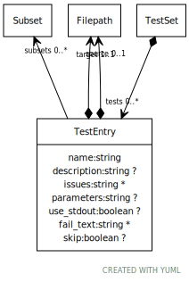

# Class: TestEntry

A specific test to be executed in the context of a module

URI: [test:TestEntry](https://linkml.org/testing/TestEntry)

## Referenced by Class

 *  **None** *[➞tests](testSet__tests.md)*  0..\*  **[TestEntry](TestEntry.md)**

## Attributes

### Own

 * [➞description](testEntry__description.md)  0..1
     * Description: Reason the test exists -- what it tests
     * Range: [String](types/String.md)
 * [➞issues](testEntry__issues.md)  0..\*
     * Description: Github issue(s) that the test addresses
     * Range: [String](types/String.md)
 * [➞source](testEntry__source.md)  0..1
     * Description: source file or directory -- none if omitted
     * Range: [Filepath](Filepath.md)
 * [➞target](testEntry__target.md)  1..1
     * Description: target file or directory
     * Range: [Filepath](Filepath.md)
 * [➞parameters](testEntry__parameters.md)  0..1
     * Description: generator parameter string
     * Range: [String](types/String.md)
 * [➞use_stdout](testEntry__use_stdout.md)  0..1
     * Description: output appears on stdout.  Catch and redirect to the output file
     * Range: [Boolean](types/Boolean.md)
 * [➞fail_text](testEntry__fail_text.md)  0..\*
     * Description: If present, string(s) that should be found in failure text
     * Range: [String](types/String.md)
 * [➞subsets](testEntry__subsets.md)  0..\*
     * Description: Subset(s) that this particular test belongs to. Can be used as a filter
     * Range: [Subset](Subset.md)
 * [➞skip](testEntry__skip.md)  0..1
     * Description: Skip this test if true
     * Range: [Boolean](types/Boolean.md)
