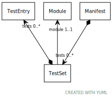

# Class: TestSet

URI: [test:TestSet](https://linkml.org/testing/TestSet)

## Referenced by Class

 *  **None** *[➞tests](manifest__tests.md)*  0..\*  **[TestSet](TestSet.md)**

## Attributes

### Own

 * [➞module](testSet__module.md)  1..1
     * Description: module to be tested
     * Range: [Module](Module.md)
 * [➞tests](testSet__tests.md)  0..\*
     * Description: collection of tests to be executed against the named module
     * Range: [TestEntry](TestEntry.md)
